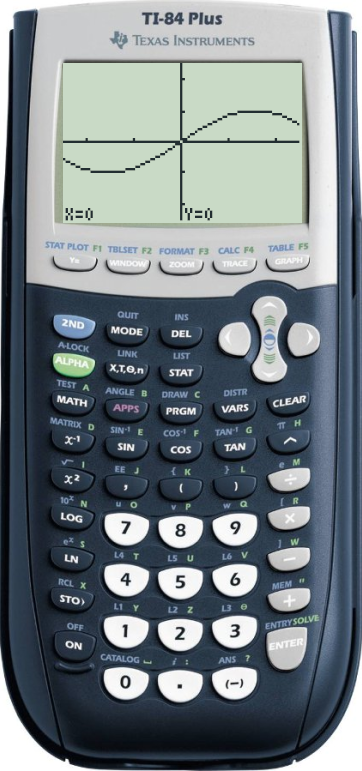
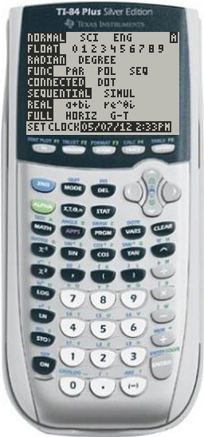

# TilEm2 USER MANUAL

## Authors DUPONCHELLE Thibault - MOODY Benjamin



## Introduction 
### What's TilEm2?  
**TilEm2** is a TI calculator emulator. It emulates all the Z80 calculators 
(73, 76.fr, 81, 82, 82stats, 82stats.fr, 83, 83+, 83+ SE, 84+, 84+ SE, 
85, and 86) and all known ROM/OS versions.

**TilEm2** is completely free, and designed for Linux (but available for Windows).

We put a lot of work in this software to offer to the community the best
possible product.

**TilEm2** also provides a full featured debugger with disassembler, breakpoints,
memory view and more.

### Some history Some of you probably already know TilEm because a first version
was released around 2000/2001 by **Julien Solignac** (then maintained by **Benjamin
Moody** since 2004).

This first version was working fine but there were some issues, skins were too
small and bad resolution and a lot of feature were missing.

Anyway, this software was pretty good (especially because the core emulation was
very good).




We decided to rewrite this emulator from scratch, keeping the philosophy of
**TilEm** but improving all the rest.

A new core has been developped by Benjamin Moody (aka "floppusmaximus"), and I
(Thibault Duponchelle aka "contra-sh") started to work on the **GTK+2** user
interface (later he helped me for this task).

### Features 
TilEm2 has basically all the TilEm old features plus a lot of new things :

* Emulates all TI z80 calc.
* Emulates all known ROM/OS versions.
* Linking : Send and receive var (use libticalcs2). 
* Screenshot.
* Animated screenshot. 
* Grayscale. 
* Save states.
* Use TiEmu skin file format (easy to do your own skin).
* And more...


Here's the right click menu option :


### What TilEm2 does NOT do 
TilEm2 do a lot of stuff that TilEm1 was not able to
do, but there's always some feature not released yet.

* Sound handling
* Calc to calc linking

But do not forget that developpement goes on and we are planning to do it !


### Skins 
You can use **TilEm2** without skin (just uncheck the "Use skin" checkbox
into the "Preferences" menu) but skins are more user friendly :)

We have made some officials and free to use skins (thank you to our
contributors).

You can do your own skins using skinedit. If you want, you can send us the skin
file, maybe it could become "official".

What do you need to do your own skin?

Just take a picture of your calc using your smartphone by example.

Scale it keeping proportion to have around 900 pixels high.

Then start **skinedit**, create a new skin, open the picture and set the key
positions.

The overall work takes less than 20/30 minutes I think.

See the chapter "Create your own skins" to know how to do.

Then you can test it with **TilEm2**. That's all!

Here are the current skins available by default :


## Installation 
### Generalities 
Before installing **TilEm2**, you should know that
no **ROM** is included in this software.

In order to use **TilEm2**, you must use your own ROM (use **TiLP** to get it).

**TilEm2** provides an installer msi for windows and script autoconf for **GNU/Linux**.

There's not a lot of dependencies so you should really have no problem to
install it.

### Dependencies 
**TilEm2** uses the following libraries :
* GTK+ 2.6 or higher (but 3.x not supported yet).
* libticalcs2.

You can find libticalcs2 on ticalc (from Romain Lievins).

### Install from sources 
Download the sources of TilEm2 on [sourceforge.net](https://sourceforge.net/projects/tilem/).

Or eventually :

Dowload the source from the trunk like this :

```bash
svn co https://tilem.svn.sourceforge.net/svnroot/tilem
```

Then install **GTK+** (e.g. for **Debian** : `sudo apt-get install libgtk2.0-dev`).

Then install [libticalc2](http://www.ticalc.org/archives/files/fileinfo/374/37479.html)

After that, simply use the configure script and the well know Linux install :

```bash
./configure
``` 

If you have no errors, so dependancies are checked and it's ok.

The Makefile have been generated so type:

```bash
make
``` 

Then to copy the icons, configuration files and tilem2 binary type:

```bash
sudo make install
```

Usually, icons will be copied into `/usr/share/tilem2/`

Keybindings and configuration file will be installed into `$HOME/.config/tilem2`

Then you can launch **TilEm2** with the command :

```bash
tilem2 -r /path/to/rom
```

Or simply :

```bash
tilem2
```

### First use 
If you do not specify explicitely a ROM on the command line, the
first launch will ask you which ROM you want to use.

If you don't know what's a ROM or how to get it, please read the chapter "Get a
ROM".

**TilEm2** will open a file chooser dialog.


As soon you press "Ok", **TilEm2 **will try to guess the model of this ROM and
check if it's a correct ROM).

When TilEm2 has a doubt, he will ask you for the model but will display only the
possible candidates (not all the z80 calc).

Anyway, if you launch a ROM, you usually know what's model it is because as I've
already said : you should have the calculator of the ROM you're trying to
emulate...


After that, TilEm2 start (but calc is off you need to press on).


The last used ROM is automatically used for the next launch of TilEm2.

You can save the current state of the calculator by using "Save Calculator".

If you cancel the ROM chooser dialog, TilEm2 automatically shutdown.

## Getting a ROM image
In order to emulate a calculator, you must have a copy of the calculator's
operating system. This file is referred to as a ``ROM image,'' because,
traditionally, the OS was stored in the calculator's Read-Only Memory. (More
recent calculator models store the OS in Flash memory instead, but the name has
stuck.)

The ROM code (which forms the ``brain'' of the calculator) is copyrighted by **TI**,
so it is not included with **TilEm**.  Instead, you will need to copy the ROM from a
calculator you own.  There are various ways to do so:


* For most calculator models, you can connect the calculator to your PC and
  download the ROM directly using the free software TiLP.

* For the **TI-83 Plus** and **TI-84 Plus**, Andree Chea's `rom8x` tool allows you to
  copy a portion of the code from your calculator (using either TiLP or some
other software, such as TI Graph Link or TI-Connect) and combine it with one of
the OS upgrade files that are available from TI's website.

* For the **TI-81**, the `dump81` package can be used to copy the ROM contents using
  a digital camera.  The other option (since the **TI-81** has no I/O ports) is to
take apart your calculator, desolder its ROM chip, and read the contents with an
EEPROM programmer.


### Getting a ROM using TiLP 
TiLP is a free software program for communicating
with TI calculators of all types.  Like **TilEm**, it runs on a variety of
platforms, including **Windows**, **Mac OS X**, **GNU/Linux**, and **FreeBSD**. (If you've
installed **TilEm** from source, you've already done most of the work of installing
**TilEm**)  You can download **TiLP** from [Tilp](http://tilp.sourceforge.net/).

To use TiLP, you will also need a cable to connect your calculator to your
computer.  The TI-84 Plus can be connected using a standard mini-USB cable; for
other calculators, you can either buy an official TI Graph Link cable, or (if
you're feeling adventurous) build your own.

#### Starting TiLP When you launch TiLP, the main window appears:


If it does not detect your calculator automatically, select `File` `subsubmenu`
`Change Device` (for older versions of TiLP, right click on the left pane and
select `Change Device`.) Ensure that the ``Cable'' and ``Calc'' options are
correct, and that your calculator is turned on and connected.  Click the
`Dirlist` button to list the variables on your calculator, and test whether the
cable is working.

Dumping the ROM requires you to run an assembly program on your calculator.
Although these programs have been well tested, there is always the possibility
of something going wrong, so you may want to take this opportunity to back up
any important files from your calculator.

##### Installing a shell 
If you have a **TI-73**, **TI-82** or **TI-85**, you will first
need to install an assembly shell.  These shells are not included with TilEm or
TiLP, but can be downloaded from the Web:

* Mallard for the TI-73: [](http://www.ticalc.org/pub/73/asm/shells/mallard.zip)
* SNG for the TI-82: [](http://www.ticalc.org/pub/82/asm/shells/sng.zip)
* ZShell for the TI-85: [](http://www.ticalc.org/pub/85/asm/shells/zshell.zip)


To install the shell, you will need to send a memory backup file.  Note that
this replaces the entire calculator memory contents.  First, put the calculator
into link mode if necessary:

* On the **TI-82**, press `2nd` `X,T,theta` => ENTER`.
* On the **TI-85**, press `2nd` `x-VAR` `F2`.

Next, use the `Restore` option in TiLP to send the `.73B`, `.82B`, or `.85B` file to
your calculator.  You will need to press `ENTER` on the **TI-82**, or `F1` on the
**TI-85**, to accept the memory backup.

##### Running the ROM dumper 
If you have a **TI-82** or **TI-85**, put the calculator
into link mode again (using the same key sequence as above.)  Next, double-click
on the `Operating System` item in **TiLP**.  It will show a warning message:


It will ask you again to confirm that you know what you're doing:


The ROM dumper will then be transferred, and if possible, launched
automatically.  On the **TI-73**, **TI-82**, or **TI-85**, you will need to launch the ROM
dumper manually:

* On the TI-73, run `prgmA` to start Mallard; ``ROM Dump'' should already be
  selected, so just press `ENTER`.
* On the TI-82, run `prgmROMDUMP`.
* On the TI-85, press `CUSTOM` `F1` to start ZShell; select ``ROMDump'' and
  press `ENTER` to run it.


The ROM transfer will take some time...


## Main features
In addition to emulate the behaviour of a real calc, **TilEm2** features main
functionnalities as file loading and file export, screenshot, debugger.

In this chapter, we will talk about these main features.

In an another chapter, you will find a detailed explanation of all options of
TilEm2.

### Send a file from PC to TilEm2
Here we talk about sending a file from computer to emulated calc.

You downloaded a file on the web and you want to test it before sending it to
your calc?

You compiled a file and you want to see the result?

So you probably want to use send file feature...

There's 3 ways to do that.

##### Using the right click menu option
First, right click on the calc.

This menu popup will appear : 


Click on `Send file...i`

(You can bypass the popup menu by clicking CTRL + O)


Then explore your computer and choose the file(s) you want to send.

Usually, variables are suffixed by something like `.82p` (ti82), `.83p` (ti83) `.8xp`
(ti83+, ti84+), `.86p` (ti86) or something else.

Grouped files are generally suffixed by `.82g` (ti82), `.83g` (ti83), `.8xg` (ti83+,
ti84+), `.86g` (ti86) or something else.

Some other special extensions as `.8kv` are flashapp for ti83+, ti84+.

And a lot of other possible file extensions.

It could take some time to load a variable so a current progress bar is displayed
while loading to know what's happening.

As soon as you press OK, the file starts to be loaded and a progress bar is
displayed.


##### Using drag and drop 
Simply select one or more files on your computer and use drag and drop to 
send the files :


You will not see any visual feedback (no progress bar) but you can see in your
terminal eventually the libticalcs debugging messages.


You can check if your program is correctly uploaded to calc by listing them
inside the program menu (if it's a program) :


##### Using the command line
You can also send a file to the calc at startup using command line parameters.

All the non options args are sent to the calc.

```bash
tilem2 -r $rom ion.83g
```

This example will load the group file ion.83g in the calc memory.

### Get a var from calc to PC
To get a program, list, screen, application or whatever which is considered are
a var on the calc you need to use the right click menu options :

(Or you can simply use `CTRL + S`)


At this point, **TilEm2** will (try to) get the variables and print them into a
list.

This is why you will see the progress bar.

Warning : update is not done each time the window is popup, you need to refresh
manually the vars.

You can select one or more vars in the list then saving it by clicking "Save".


A check button lets you choose the format of the output.

If you want to get more than one var, you can save it as grouped file or as
separate files (separate files is as you get it one by one).


Then simply click save and choose a place to backup the var(s).

### Record or grab a screenshot
As screenies are a good way to show your projects or whatever you want, TilEm2
provides a complete screenshot dialog.

We think this dialog to be user friendly and powerful.

There's also a special manner to quickly screenshoot the LCD content ("Quick
Screenshot" or `SHIFT + CTRL + PRINT`).

We will describe this method in a first subsection then we will talk about more
powerful methods.

##### Grab a screenshot using "Quick Screenshot"
You can grab a screenshot without using screenshot dialog.

Simply click on the "Quick Screenshot" menu option or `SHIFT + CTRL + PRINT`.

The screenshot use the default options (or the options you have given into
screenshot dialog).

The picture is stored into the directory you usually use for screenshot OR if
not exists into the `$HOME/.config/tilem2/screenshots/` or equivalent if you're not on
**GNU/Linux**.


##### Grab a screenshot using the screnshot dialog
Click on "Screenshot" menu option or use CTRL + PRINT.


The screenshot window will open.

TilEm2 automatically grab a screenshot at startup.


You can choose to "Save" it or to grab another screenshot.

There's a lot of options as size, foreground/background color etc...


There's some differents kind of output format as png, bmp or some other else.

##### Record a gif
Click on "Screenshot" menu option or use CTRL + PRINT.


The screenshot window will open.


You can record a gif by clicking "Record".

Stop the gif by clicking "Stop" (What a surprise :D).

As soon you click "Stop", a preview is available in the picture area.

There's a lot of options as size, foreground/background color etc...

You can set these options after recording the animation.

When you have the desired animation, clickon "Save" button and choose a place
and a filename to save the gif.

##### Screenshot options
Static screenshots as well as animated screenshots both use settings. Here's how
to use these settings.

#### Size
You can choose between "default" size for the screenies :

7 default sizes for the TI-86 and 3 for the other models.


For the TI-86, ratio and values proposed by default are different: 


Default values are proposed to help you to choose correct ratio (the choice
depends on the size of the LCD).

Here's what you have for all models except TI-86 :


* 96 x 64


* 192 x 128


* 288 x 192


I will not show the same screenshot for the TI-86 it's not necessary.

This is "default" sized screenies but you can set your own (warning : try to
keep the ratio).

Setting your own size could produce some curious results (here the biggest
possible) :


#### Animation speed
There's a setting called "Animation speed" which is used by the animated
screenies.

If you increment this value, the animation will run faster.

A visual feedback will show you the effect of increasing this value.

The max is set to 100.


#### Foreground and background colors
Below the "animation speed" there's 2 color chooser which allow you to set your
own colors for foreground and background colors (as you know z80 calc LCD is
monochrome).


The grayscales screenies are fully compatible with this setting of course
(because it's no more than "flashing").

Here's a sample of what you get if you choose a pink as foreground color and
green as background color :


Let's see a bunch of colored screenies:


Of course these settings are usually used to correct contrast or simply set a
better color ratio (not to do the useless but funny screenshots I've shown just
before).

#### Grayscale


A last setting called "Grayscale" let you choose the rendering mode.

### Use the debugger 
This is an important part of an emulator...
The debugger provide an easy way to inspect the core of the calc and to find
bugs into your projects.

##### General presentation
When you start the debugger (using "Pause" or the right click menu entry) 


The calc will be paused automatically (you can't work with debugger while calc
is running that's evident).

If you click on `F5` to run the calc the emulator will be deactivated to prevent
to edit anything in the debugger.

You can pause the calc by clicking `ESC` (escape).


Or by using the "Pause" button (tool bar behind the menu bar).


The aim of the debugger is to show the disasm memory, the registers, stack and
the memory.

The values are written in hexadecimal format. Not decimal.

What does it mean?

Simply one little sample :

```
increment 0 = 1; 
increment 1 = 2; 
increment 2 = 3; 
increment 3 = 4; 
increment 4 = 5; 
increment 5 = 6; 
increment 6 = 7; 
increment 7 = 8; 
increment 8 = 9;
increment 9 = A; 
increment A = B; 
increment B = C; 
increment C = D; 
increment D = E; 
increment E = F; 
increment F = 10;
```

Ok we will not explain more the hexadecimal format, just accept the fact that's
in hexadecimal format.

For a good portion of **TilEm2** users, hexadecimal is not a surprise :)

Let's talk about widget organization.

##### Widget organization
There's at least 6 zones into this window :

* The menu bar :


* The button bar :


* The disasm view :


* The memory view :


* The register view :


* The stack view :


All this view produce the debugger (there's some other window hidden by example
breakpoints dialog and keypad window).


##### Use the disasm view
As you probably know, there's a register which store the address of the current
instruction.

It's called PC ("Program Counter").

If you look into the value of PC, you should recognize that the value is the
same as the address pointed by a yellow arrow in the disasm.
 
This is the current instruction which is executed.

See this example :


As you may know, even if z80 is most like "RISC" methodology (in the sense the
mnemo are pretty simple and fast) the size of the instruction depends the
instruction itself.

That's why the address are not linearly incremented.

Sometimes an instruction is stored on 1 byte, sometimes 2 bytes, sometimes 3
bytes etc...

A sample for 1 byte sized instruction :


A sample for 2 bytes sized instruction :


A sample for 3 bytes sized instruction :


This view show the disasm memory, so you can see the entire memory, but not as
hexadecimal value but as assembly mnemos.

As you can see, some values are replaced by their symbols.


This is not a default behavious of a z80 debugger, so that's the job of an
equate file loaded by **TilEm2** at startup (files called .sym into the data
directory).

In fact that's just address values replaced by a label (for human readable
purpose).

Exactly as you use an equate file instead of calling directly the address for a
call.

When you use "call BUFCOPY" (ti83), you don't want to see the exact value of
this jump.

Always about the disasm view, you can "Go To Address..." : 

Using right click on the disasm view : 


Or using the "Go" menu into the menu bar :


This option lets you choose an address to "jump" (only user interface no action
on the calc).

Because it can be very annoying to scroll the disasm view.


One more time : "Goto address" doesn't change anything to the "PC" or whatever.
 

You can also use CTRL + L to do this task without using the mouse.

Another option is to jump to the "PC". It's like goto address, but without
prompting an address, it will jump to the "PC" directly.

Using it from the menu bar ("Go" menu) : 


Or right click on the disasm view :


Now let's talk about interactivity.

As you can see, a a lot of informations are updated each time the calc run (or
do a step).

Stack, registers, and memory is updated in the same time the disasm view is
modified.

There's of course some possible actions to do to execute one or more steps.

Here we will only study disasm related stuff, keeping breakpoints and
registers/stack for later.

The actions you could do :


* Step : Execute one instruction.
* Step Over : Run to the next line skipping subroutines.
* Finish Subroutine : Run to the end of the current subroutine.


#### Step
You can execute this action by clicking on the button in the button bar :


Or click on the "Step" menu entry into the "Debug" menu into the menu bar :


Or simply use "F7".

This action simply execute one step.

Warning : Execute one step doesn't mean going to the next line !

If the instruction is a call or a jump, it will load another value into the "PC"
so possibly jump elsewhere.

This action is the best choice to follow "step by step" the behaviour of a
program.

#### Step Over
You can execute this action by clicking on the button in the button bar :


Or click on the "Step Over" menu entry into the "Debug" menu into the menu bar :


Or simply use "F8".

This instruction is useful to do not enter into subroutines.

What's a subroutine?

Simply a jump materialized by a `CALL` (or `BCALL`) which push the return address and
finish by a `RET`.

#### Finish Subroutine
You can execute this action by clicking on the button in the button bar :


Or click on the "Finish Subroutine" menu entry into the "Debug" menu into the
menu bar :


Or simply use "F9".

This action simply run to the `RET` instruction then pause after the execution of
the `RET` (which is basically poping the value on the stack into "PC").

This "Finish Subroutine" is helpful if you enter a subroutine which is quite
long and you don't want to inspect it, so simply finish the suroutine easily.

##### Use the register view 
In addition to run step by step and inspect the
disasm instruction, you would probably know what's happening when you run one
instruction.

Why a jump is never executed? What's the content of a register after an
instruction?  What's the flag state after an instruction?

The register view provide an easy way to inspect and edit the register values.

Firstly some asm z80 reminiscence :


* "SP" is the Stack Pointer (the top of the stack will always be stored into the
  value of "SP").
* "PC" is the "Progam Counter", so the address of the current instruction.
* "HL", "DE", "BC" are generalistic registers. They could be splitted into 2
  registers of 8 bits.

Usually, "HL" is used as source for load memory operation, "DE" is usually used
as destination, and "BC" is usually used as counter.See by example LDIR and LDDR
instructions.

There's a special register called "AF" which is basically rarely used as 16 bits
register because "F" is a 8 bit flag register and "A" is the accumulator
register.

* "A" is the most used register (by the user).
* "F" is a register which is often updated depending the instruction (`LD` never
  update it, but `AND`, `CP`, `SUB`, etc... does).

Wikipedia says : "(A) and flag bits (F) carry, zero, minus, parity/overflow,
half-carry (used for BCD), and an Add/Subtract flag (usually called N) also for
BCD".

The "F" register is used very often when you do `JMP [condition], label` or `CALL
[condition], label`  (label could be an address).

There's some other registers "IX" and "IY" which are 16bits registers.

* "IX" and "IY" are usually used as offset (SET use IY by example).

Some other registers are called "shadow register".

Their names are "AF'", "HL'", "DE'", "BC'".

You can exchange the value of non shadow register by executing `EXX` and `EX`.

To finish to explains what you can see in the register part, there's "IM" which
is interrupt mode.
 
* The level of "IM" (0, 1 or 2) determine which interrupts are executed or not
  (HALT or an home made interrupt by example are not executed in all modes.
* "EI" is enable interrupt.
* "I" is the address of the interrupt vector.


The values of these registers are updated (not always) and you can inspect what
your program is doing.

You can also edit these registers/values just by clicking on the input and
replace the current value.


There's a bunch of toggle button to show and edit the "F" flag.

If you click on a button, you will set or reset a bit of the "F" register.

You can see that each time you toggle a button the "AF" register is modified.


You can change the values of the register as you want for testing what could
happen if a value was different or whatever you want.

If you try to change "PC" value, you will see the disasm view updated.

Warning : this is usually not useful but why not...

If you try to change the "SP" value, you will see the stack view updated.

Try by example to set "FFFF" as value of `SP`... Then the stack view only contains
one value !

##### Use the stack view
TilEm2 provide a view of the stack represented as a list of "address: value".


You can navigate through the values in the stack to inspect them.

Let's a little explanation about what's a stack?

The stack is a particular memory access to store an retrieve values using the
LIFO method.

The higher place in the stack is always the lower address.

For ti83, the stack starts at address `FFFF` for the first value.

Each time you PUSH a value, the "SP" is decremented by 2 (each place is 2
bytes).

A POP increment the "SP" by 2.


As said previously, if you try to set manually the "SP" to the value `FFFF` (for
ti83), you will completely drop all values of the stack except the last one.

This view is basically more a feedback because you can't edit it. 


There's an interesting feature in **TilEm2** which help to find the instruction
which modify the stack.

You can find these actions in "Go" menu into the menu bar.

Or using `ALT+PAGEUP` or `ALT+PAGEDOWN`.


When you use this, you will jump (not really jump) to the instruction which
modify the current stack value.

It will update your disasm view but change nothing to the current state of the
calc (no change in registers, "PC" not modified etc...).

##### The memory view
This should be easy to understand that this view only print the memory in
hexadecimal format.


You can scroll through the memory and edit it (when it possible).

To edit, simply click on a particular value.
 


Now, try to edit the value in the address 0000 (for ti83).


You simply can't !

Why TilEm2 do that?

Simply this is a place of ROM (so read only).

In fact you can't edit the entire memory but only some part (but your programs
and variables will always be in RAM so you could edit it without any problem.

##### Logical or Absolute addresses
Now that we have seen a big part of the debugger, let's see an option which will
change the notation of the address into logical or absolute representation.

Here's the result :


##### Keypad
There's a completely independant widget which is poped up when you click on
"Keypad" into the "View" menu into the menu bar.


This widget allow you to see how the buttons are connected (which bit in which
group).

This is mostly used in direct input (use non blocking port to scan keys instead
of a system call as `CALL GETKEY`).


##### Breakpoints
Imagine that you want to inspect a part of code, but how to run the program
normally and stop just before the part of the code you want inspect?

Try to run/pause randomly to finally stop in the right zone is stupid (and hard
to do usually).

The solution is to use breakpoints.

What's a breakpoint?

A breakpoint is just say "When the "PC" is equal to this address, then pause the
program".

Assuming you have a routine called "DrawGbuf" and you want to stop just at the
start of this routine.

How to know the address?

Simply use the correct option in your assembler to generate the "listing" file
which contains the equates between labels and adress (-T option with spasm).

Then look for the "DrawGbuf" label into the file (with spasm the file use the
".lst" extension).

I found the address 9e4f (hexadecimal of course).

```bash
tib@cobra:~/Code/z80/project$ cat project.lst | grep drawGbuf 
71 9dce: CD 4F 9E -  	call drawGbuf 
94 9e4f: -  -  -  -  drawGbuf: 
``` 
As you can see, a label does not take place into the final binary, 
it's only a name for an address only for human.

Now you have the address, simply run **TilEm2**, launch debugger, then open the
breakpoint dialog :

In the menu bar, click on "Debug" and click on "Breakpoints" :


Or simply press CTRL+B.

Then the "Breakpoints" dialog appears :


As we want to set a breakpoint on 9e4f (which is the start of the "DrawGbuf"
subroutine), we need to "Add", so simply click on "Add".

Another dialog opens and we simply keep the default values and type 9e4f in the
"Adress" input.
 


The list of breakpoints is updated and as we can see the breakpoints is present.


Now use "Run" from the button bar, of the "Debug" menu or simply "F5".

The debugger will stop when the address is encountered (could be never).

In our case, I know that "DrawGbuf" is frequently used because I use it as soon
as possible to refresh the LCD.

So as soon as I do "F5" (run), the debugger stop on the `9e4f` address.


As my first idea was to inspect the instructions into this subroutine, I can
step by step and eventually do "F5" which will run and breaks immediately (I've
said this is used very often in my code).

Ok I assume you have understood this basic example of uses breakpoints.

Now, I want to add another breakpoint on `9e8f` which is a bit higher in memory.

So `CTRL+B` then "Add" then put `9e8f` into the text input.

Now I have :


Finally I see it's was never reached so I want to change the address so I launch
the breakpoints dialog and click "Edit".

And I put an address just after the first breakpoint.


Then I run, and I see that the second breakpoint is reached :).


Now If I want to delete a breakpoint, I simply use "Delete".

If I want to keep the breakpoint but just deactivate it temporarly, then uncheck
the checkbox into the "Type" column.


I can break the program using a range of address.

By example, I want to stop the execution between `9e4f` and `9e56` because I'm not
sure where exactly to add the breakpoint.

So I deactivate my previous breakpoints and "Add" a breakpoint with a range of
value (use toggle button "Range") starting from `9e4f` then finishing at `9e56`.


Our list look like this now :


And each instruction inside this range is marked as "Break" :


Now, I want to put a breakpoint on each `RET`.

So I use "Add" then I choose "Z80 Instruction" into the "Breakpoint type"
listbox.

As you know `RET` is "C9" as opcode so just type `C9` 


Then we have :


Ok now just remove this breakpoint.

You can also set a breakpoint when accessing the ports.

As I use "Direct Input" method to scan keys in the project, I want to see when I
read from the port 1 (keyboard).

So I click on "Add" then I choose "I/O" port then I check "Reading" then I give
the 01 value for the keyboard port.


Let's see if all is correct.


And of course it works fine :


As you can see it stops just after reading the port (on the CP mnemo which is
the group to test).

Now I want to stop on "Undocumented instruction" and "Illegal instruction".

An undocumented instruction is an instruction which was not explained into the
z80 datasheet but usable anyway.

A illegal instruction is just a bad instruction .

To do that, I simply check the check button like this :


Finally, as I finished to debug my application and just want to run it normally,
I just clear all the breakpoints by clicking "Clear".


Simply click "Clear" then all will disappear.

To finish about breakpoints, you should know that you can check "Reading",
"Writing" and "Executing" for a "Memory address" breakpoint too.

You can also specify logical or absolute addresses.

You can set a breakpoint easily without using the breakpoint dialog by doing
right click then "Breakpoint Here".

It will put a breakpoint on the current instruction selected into the disasm
view.


## List of functionnalities
This chapter is most like a dictionnary than real explanation. Please refer to
the first part ("Basic tasks") for the subject which are already explained.

### Menu 
As TilEm1, the menu is a popup menu (right click).

All you want to do need to use this menu.


As you can see, there's all you need, no more, no less:

* Send File... : Load a file from your computer to TilEm2.
* Receive File : Launch a menu where you can store a variable from TilEm2 to
  your computer.
* Open Calculator... : Load a ROM.
* Save Calculator : Save the current state of the calculator (in a separate sav
  file)
* Revert Calculator : Revert the state of the calculator.
* Reset Calculator : Reset the calc of course.
* Debugger : Open the debugger window.
* Macro : Record, play, open or save a macro (a kind of script to do some
  actions automatically).
* Screenshot : Open the screenshot menu (static and animated screenshot).
* Quick Screenshot : Grab a screenshot and save it without prompting (that's why
  it's "quick").
* Preferences : Open the preference window.
* About : Open the about dialog (informations on the authors and more)
* Quit : Close TilEm2 properly


### Send File...


This is one very important feature, because emulators are usually used to try
some programs before really transferring it to real calc.

When you click on this menu entry, a file chooser dialog is opened and let you
choose a file.


A lot of people don't know which file extension is associated with the emulated
model...

To help them, some patterns are used to do the selection.

When you let "All compatible files", **TilEm2** do the job for you, but you can
choose "All files" if you know what you're doing (a file with an incorrect
extension by example).


It could take some time to load a variable so a current progress bar is printed
while loading to know what's happening.


### Receive File...


When you click on "Receive File..." menu entry, **TilEm2** firstly get the vars then
prints it into a listview.


After the first launch, refresh is made only on request !

If you click "Receive File..." then close the window, then create a program and
click "Receive File..." you will not see your program.

The variable list let you choose the stuff you want to backup.


If more than one variable is selected, you can choose between two modes of
backup : "Separate files" or "Group file".

If you choose separate, each file is saved as if you have saved one by one.


If you save grouped, a group file will be created on disk.

When you finally click on "Save" button, a file save dialog is opened.

Choose a directory and a name and click "Save".


### Open Calculator...


When you click on "Open Calculator...", a file chooser dialog pop up and let you
choose a ROM to load.

So in fact even if you already emulates a calculator, you can switch to another
just by opening a new ROM file.

Another way to do that is to quit **TilEm2** and restart it using another ROM file
(option `-r`).


Rom files usually finish by .rom as extension but you can use "All files"
pattern if you have a ROM with a odd extension.


### Save Calculator...


This option just save the current state of the calculator in a `.sav` file.

The file is created in the same directory as the ROM file and with the same
name.

### Revert Calculator State


No surprise, this option just revert the calculator state (if possible).

### Reset Calculator


Guess what does this option :)

### Debugger


When you click on this option, the debugger window will appear.


There's a lot of things to say about debugger.

When you launch it, calculator is automatically paused.

As you can see there are 5 big buttons : `Run`, `Pause`, `Step`, `Step Over`, `Finish
Subroutine`.

Step just execute one instruction.

As you can see, all the instructions are not the same length, that's why it
doesn't step one byte per one byte.

Step over do the same job than step but do not follow call.

Finish subroutine just do basically the same job but stop after a ret.

Now just see what's the differents view of the debugger dialog.

There's a big frame for disassembly view.

In this frame, you can see the address and the disassembly instruction.

On right click, you can do some useful actions : `Breakpoint here`, `Go to address`,
`Go to PC`.


There's 2 kind of address notation for this view : `Logical` and `Absolute`.
 
You can switch it into the "View" menu.


The second big frame is the memory view.


For this view you can switch the addresses representation if you want.

In this view you can see what your calculator contains.

You can also edit the memory and change some values by your own.


A third view represents the registers.

You can edit them too.

Below registers there is a bunch of toggle button to represent the flags (you
can change it).

Then Interruption `Mode IM`, `I`, and `Enable Interrupt` (checkbox).

The finally the stack.

At the top of the debugger window, you can see a menu "Debug".


The options are the same than buttons but there is a big news : breakpoints.

Breakpoints are a big part of the life of a assembly developpers.

This option opens the Breakpoint menu when you can "Add", "Remove", "Edit",
"Clear" or some special action like "Break on invalid instructions" or "Break on
undocumented instructions".


The easiest way to add a breakpoint is to right click on the disasm view and
click on "Breakpoint here" but you can also set a breakpoint using its address
(logical or absolute).


The "Go" menu basically provide and easy way to navigate into the disasm view
and th e stack.


Now I must talk about a nice tool called Keypad (into View menu).


### Macro
Macros are an easy way to simulates key press, file loading, reset
automatically.

It means that you could record a macro then click on some keys, then stop.

If you play it, tilem will press the same keys for you.

Have you never think too lazy to press always "2nd catalog asm(" each time you
want to test your new asm production.

Simply use a macro to load and launch your program automatically !


About the options, you can play an already loaded macro or a macro you just have
recorded.

You can also open a macro and save the current macro (which one you just have
recorded).

### Screenshot...


By clicking on this option, you launch a screenshot dialog.


You can grab static screenshot (multiple format) or animated screenshot (will be
saved as gif).

As you can see **TilEm2** has a lot of screenshot configuration.

So you can change the size, change the foreground and background colors.

Use or not grayscale.

### Quick Screenshot


By clicking on this option, you grab a screenshot.

### Preferences
This is where you can set the skin (or disable using it) and some important
other stuff.


You can limit speed or not.

Emulate grayscale (if you don't know just let it checked by default).

Use smooth scrolling.


And an important user friendly feature...

Set skin !

When you click on the button, a file choose will popup and let you choose the
skin.


### About


No more than an about dialog :)


### Quit


Bye Bye ;)

## Command line usage
### Basics 
**TilEm2** is basically made for **GNU/Linux** and command line is our first love :)

Here the options at launch.

```bash
Usage:
  tilem2 [OPTION…] FILE

Help Options:
  -h, --help                  Show help options
  --help-all                  Show all help options
  --help-gtk                  Show GTK+ Options

Application Options:
  -r, --rom=FILE              The rom file to run
  -k, --skin=FILE             The skin file to use
  -m, --model=NAME            The model to use
  -s, --state-file=FILE       The state-file to use
  -l, --without-skin          Start in skinless mode
  --reset                     Reset the calc at startup
  --get-var=FILE              Get a var at startup
  -p, --play-macro=FILE       Run this macro at startup
  -d, --debug                 Launch debugger
  --normal-speed              Run at normal speed
  --full-speed                Run at maximum speed
  -c, --cable=TYPE[:PORT]     Connect to an external link cable
  -a, --audio                 Enable audio output
  --display=DISPLAY           X display to use
```

You should usually use something like : 

```bash
tilem2 -r /path/to/my/rom
```

All the non option arguments are considered as files to be loaded.

But as you can see you can specify the skin with `-k`.

If you usually use more than one model, you can try -m and it will load the ROM
associated with this model (if you already start a ROM from this model).

You can specify a different "save state" (by default it uses the one which is
called as the ROM file).

You can start skinless.

You can load a file and even launch a macro at startup (in this case loading a
file is done before macro playing).

You can reset too, get a var (if possible) and launch debugger.

Some options could be set at startup as normal speed or full speed (as fast as
possible).

Other options are not **TilEm2** options (`--display` by example).

Something is missing?


### Examples
First starting using configuration file (need to have already started one time
before). 

```bash
tilem2
```

You can specify the ROM to use:

```bash
tilem2 -r /path/to/my/rom.rom
```

You can choose a skin at startup

```bash
tilem2 -r /path/to/my/rom.rom -k /path/to/my/skin
```

Choose a save save state: 

```bash
tilem2 -r /path/to/my/rom.rom -k /path/to/my/skin.skn -s /path/to/my/savestate.sav 
```

Or just starting a model without giving a ROM file:

```bash
tilem2 -m ti83
```

Starting skinless :

```bash
tilem2 -m ti83 -l
```

Reset the calc at startup :

```bash
tilem2 -m ti82 --reset
```

Trying to get a var at startup:

```bash
tilem2 -m ti82 --get-var=ION
```

Starting in full speed mode:

```bash
tilem2 -r $rom --full-speed
```

Or in normal speed:

```bash
tilem2 -r $rom --normal-speed
```

Play a macro at startup:

```bash
tilem2 -r $rom /path/to/my/best/program -p /path/to/my/macro 
```

Warning, in this situation, load + macro play, the load is done before the macro
playing.

You can also launch debugger (and pause the calc by extension) :

```bash
tilem2 -r $rom -d 
```

## Configuration files 
### General configuration 
You should not edit this file because you don't need it.

If something goes wrong, by your fault or a bug in **TilEm2**, just get a new
configuration file from the **TilEm2** website and replace the wrong **config.ini**
file.

It's usually copied into `$HOME/.config/tilem2/config.ini`

### Keybindings 
The keybindings are defined in a **keybindings.ini** file (usually
copied into `$HOME/.config/tilem2/keybindings.ini`).

There's currently no tool to interactively edit this file, but you can edit it
by hand if you do this carefully.

This file uses inheritance, it means that a part of the keybindings are common
to all models, but you can rewrite them for each model.

So firstly, **TilEm2** parses common, then if he find another keybinding for the
same keypress, he rewrite it.

There's one subsection per model.

Here's a piece of the keybindings file : 
```bash 
Up                = Up
KP_Up             = Up
Down              = Down
KP_Down           = Down
Left              = Left
KP_Left           = Left
Right             = Right
KP_Right          = Right
Shift+Up          = 2nd, Up
Shift+Down        = 2nd, Down
Tab               = 2nd
KP_Tab            = 2nd
ISO_Left_Tab      = 2nd
Delete            = Del
KP_Delete         = Del
BackSpace         = Left, Del
Ctrl+BackSpace    = Clear
Ctrl+Delete       = Clear
Ctrl+KP_Delete    = Clear
0                 = 0
KP_0              = 0
1                 = 1
KP_1              = 1
2                 = 2
KP_2              = 2
3                 = 3
KP_3              = 3
4                 = 4
KP_4              = 4
5                 = 5
KP_5              = 5
6                 = 6
KP_6              = 6
7                 = 7
KP_7              = 7
8                 = 8
KP_8              = 8
9                 = 9
KP_9              = 9
period            = DecPnt
KP_Decimal        = DecPnt
asciitilde        = Chs
dead_tilde        = Chs
plusminus         = Chs
Shift+KP_Subtract = Chs
dollar            = 2nd, Chs
plus              = Add
KP_Add            = Add
minus             = Sub
KP_Subtract       = Sub
asterisk          = Mul
KP_Multiply       = Mul
slash             = Div
KP_Divide         = Div
asciicircum       = Power
dead_circumflex   = Power
twosuperior       = Square
Ctrl+2            = Square
parenleft         = LParen
parenright        = RParen
greater           = Store
less              = 2nd, Store
F12               = On
Shift+F12         = 2nd, On
Return            = Enter
KP_Enter          = Enter
ISO_Enter         = Enter
Shift+Return      = 2nd, Enter
Shift+KP_Enter    = 2nd, Enter
Shift+ISO_Enter   = 2nd, Enter
```

* Left values are the computer keyboard key names.
* Right values are calc keys.
* `+` means pressing the two or more keys simultaneously.
* `,` means the same thing for the calc.

We know that it's not easy for you to modify this file, but if you make a
mistake, tilem will say **"error while parsing keybindings"** but it will work anyway.

In the future, we will probably add a user interface integrated to **TilEm** to
change keybindings, but for the moment it doesn't exist !

## Tips and tricks for developpers 
Here are some tips to help you to develop your projects.

### Scripting you application 
Each time you compile your program, if you must do
5 or 6 click to launch you program on the emulator that's pretty annoying.

Record a macro to do that and execute it at startup.

If you load files, they are stored into the memory before the macro is launched.

So record a macro and put it with your project (here into `macro/play.txt`).

Here's a sample of what you can do:

```bash
#!/bin/bash make	# Compile tilem2 PROG.8xp -p macro/play.txt 
```

I put this code into exec.sh then for testing my program I simply do :

```bash
./exec.sh
```

And my file is loaded and launched.

## Create your own skin` 
As mentionned previously, **TilEm2** uses a **TiEmu** skin file format.

So it's easy to do your own skins.

### Download tiemu-skinedit 
Skinedit is a part of **TiEmu**, you can download it here :

[Skinedit](http://www.ticalc.org/archives/files/fileinfo/232/23201.html)

### Create the skin 
Now, I will explain to you how to create your own skins.

A picture of a game boy will be our example.


First you need to download `tiemu-skinedit` (author : **Julien Blache**).

Then launch it by :

```bash 
tiemu-skinedit & 
``` 

Or by clicking on the icon if you have it on your desktop.

Skinedit starts...


Click on **File -> New** .


Choose a picture then click "Ok".

Then find a picture and resize it to 900 pixels of height (keeping the
proportions).

Usually I use **TheGimp** like this.


But it works with any size, just 900 pixels is nice I think.

The picture is loaded and a popup ask you to give some informations (title,
author, model, contrast).

The title is a comment added in the skin file.

Same thing for the author which is very important for licencing informations.

Model is the model of the calc (here I used ti83.

Contrast is the contrast for the LCD, you can choose the background and
foreground color (or just set "low contrast" or "high contrast").


Then click on "LCD" then select the region dedicated to LCD.

When you're satisfied by the region, simply do a right click to save the region.

Then click "keys" button.
 


Select the key, then define a region (select a region then right click to save).


What I could say about the skin format is that each key is defined by a
rectangular region (there's a max number of keys hardcoded at the value 60).

So each time you define a key, it will be saved as a rectangle into the skin
file, the other unused slots keep the 0,0,0,0 values).

LCD region use the same system, with some more information (contrast...).

When you've defined all the keys (usually it's what you should do) or only some
of them (as it's the case in our funny example), you can check it one by one to
be sure it's ok.

The keys are listed in the right order. First key in the list is the left top
key (usually `Y=`), last key is the right down key (usually `ENTER`).

Warning : do not supperpose regions (it's sometimes hard to do with arrow keys).

For this tutorial, I just defined arrows, start = `ON`, select = `2nd`, B button =
`PRGM` and A button = `ENTER`.

When it's ok, save the file with a ".skn" file
extension.

And let's see the result ! 


You can also convert a **TiEmu** or **VTI** skin file using skinedit then use it with
**TilEm2** !

Do not hesitate to send us your skins file, maybe we could use it as official
skin !

